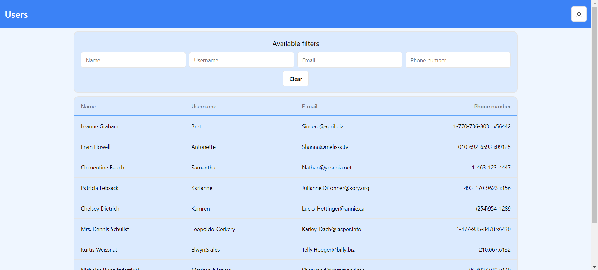
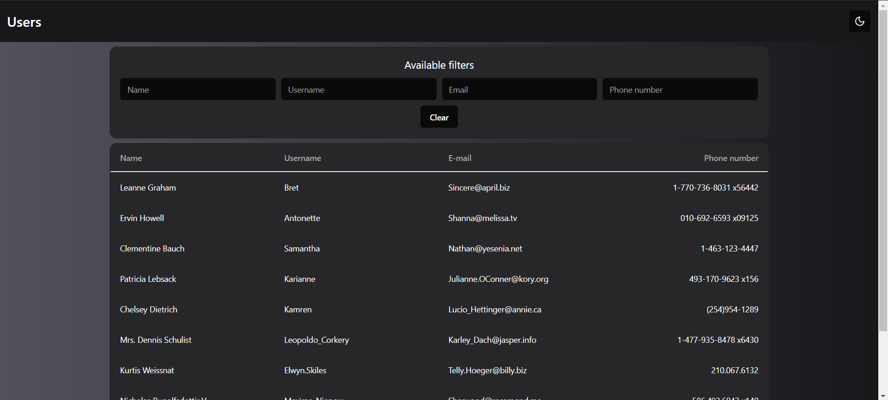

# User managment table 💻⌨️

Junior Frontend Developer assignment for Smart business.

This project allows users to view a table of users from mock API, filter them by each column, and change the website's theme.

## Created with:
Vite, Redux Toolkit, React, TypeScript, Tailwind, shadcn/ui, Figma


## Installation

```bash
  git clone https://github.com/olekszczepanowski/smart-assignment-frontend.git
  cd smart-assignment-frontend
  npm install
```
If you want to run this project on localhost:
```bash
  npm run dev
```
## Demo
[Link](https://olekszczepanowski.github.io/smart-assignment-frontend/)

Light mode:

Dark mode:


## Mockups
I've created a simple mockups for desktop and mobile devices.
https://www.figma.com/proto/yohvkBaluSAISjspWv0Wqf/Mockups-smart-assignment?node-id=2-288&t=Ld1qrFPefbv8wVjW-1

## My approach to the assignment

Before I started writing the code, I created simple mockups to make it easier to create the UI.
It was tricky for me to design the table for small devices. I had a hard time deciding whether to allow horizontal scrolling for the table or to let the text wrap in columns. From a user's perspective, it seems to me that this table would be used more for copying some data, so I decided to display the wrapped text in columns.

Coding was very enjoyable for me. I often use these technologies, so I didn't have any major issues with the implementation. I've read the best practices and style guide for Redux to improve readability and project structure. I also used components from shadcn/ui, which made creating the UI much easier.
